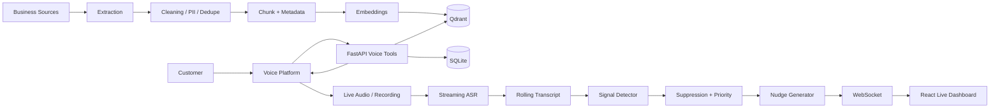

# BUILD_STEPS.md — Darwix AI Engineer Assessment

This document is the implementation sequence for Codex.

Do the steps in order. Do not start UI polish or optional infrastructure before the required acceptance criteria are satisfied.

---

# Phase 0 — Bootstrap

## Task 0.1 — Initialize repository

Create:
- `backend/`
- `frontend/`
- `data/`
- `evaluations/`
- `scripts/`
- `docs/`

Create:
- `.gitignore`
- `.env.example`
- `README.md`
- `AGENTS.md`
- `BUILD_STEPS.md`

Acceptance:
- backend starts
- frontend starts
- `.env.example` documents every required secret
- no secret values are committed

---

## Task 0.2 — Backend skeleton

Create FastAPI app with:
- config loader
- structured logging
- global exception handling
- `/health`
- CORS for local frontend

Acceptance:
```bash
curl http://localhost:8000/health
```

returns:
```json
{"status":"ok"}
```

---

## Task 0.3 — Persistence

Use:
- SQLite for prototype relational state
- Qdrant for vectors

Create relational tables/models for:
- leads
- callbacks
- calls
- transcript segments
- signals
- nudges
- latency samples

Acceptance:
- DB initializes from a clean checkout
- sample row can be inserted/read
- Qdrant collection can be created

---

# Phase 1 — Q2 Knowledge Base First

Q1 depends on this phase.

---

## Task 1.1 — Source manifest

Create `data/raw/manifest.json`.

Each source entry:

```json
{
  "document_id": "business_loan_policy",
  "path": "data/raw/business_loan_policy.pdf",
  "source_type": "pdf",
  "product": "business_loan",
  "version": "1.0",
  "language": "en"
}
```

If the assessment package did not include official business content, create a small synthetic demo dataset and label it explicitly as synthetic in README.

Do not claim synthetic rules are Darwix rules.

---

## Task 1.2 — Extraction

Implement:
- PDF extraction with page numbers
- HTML main-content extraction
- Markdown/text ingestion
- JSON/CSV ingestion

Return normalized extraction units:

```python
ExtractedUnit(
    document_id,
    text,
    source,
    page=None,
    section=None,
    metadata={}
)
```

Handle:
- empty extraction
- corrupt file
- unsupported file type

Acceptance:
- fixture PDF extracts page references
- errors are logged and marked as failed sources

---

## Task 1.3 — Cleaning

Implement deterministic cleaning:
- collapse excess whitespace
- strip headers/footers when repeated
- remove obvious navigation text
- normalize bullets
- normalize headings
- normalize common date formats
- normalize business terminology with a configurable map

Do not use an LLM as the only cleaning mechanism.

Acceptance:
- before/after fixtures demonstrate removed boilerplate
- meaningful business content remains intact

---

## Task 1.4 — PII protection

Implement basic PII flagging/redaction.

Detect at minimum:
- emails
- phone numbers
- long account/card-like digit strings
- configurable government-ID patterns

Output:
```json
{
  "contains_pii": true,
  "redacted_text": "Call me at [PHONE_REDACTED]"
}
```

Acceptance:
- unit tests for true positives
- unit tests for ordinary business numbers that should not be destroyed where practical

---

## Task 1.5 — Deduplication

Implement:
1. exact dedupe by normalized hash
2. near-duplicate detection

Simple acceptable implementation:
- normalized text hash for exact duplicate
- cosine similarity over embeddings or token-based similarity for near duplicate
- configurable threshold

Store dedupe decision in ingestion report.

Acceptance:
- duplicate fixture is not indexed twice
- near duplicate is flagged

---

## Task 1.6 — Chunking and metadata

Use semantic/heading-aware chunks where possible.

Suggested baseline:
- 350–600 tokens
- 50–100 token overlap only when needed
- never merge unrelated policy sections

Every chunk must contain:
- `record_id`
- `document_id`
- `title`
- `content`
- `category`
- `product`
- `source`
- `source_type`
- `source_page` / `source_section`
- `version`
- `contains_pii`
- `language`
- `checksum`

Acceptance:
- inspect at least 10 generated chunks manually
- source traceability is preserved

---

## Task 1.7 — Embeddings + indexing

Create provider adapter.

Pseudo-interface:

```python
class EmbeddingProvider:
    async def embed_documents(self, texts: list[str]) -> list[list[float]]:
        ...
    async def embed_query(self, text: str) -> list[float]:
        ...
```

Index chunks into Qdrant.

Acceptance:
- clean rebuild command
- count of indexed records shown
- metadata stored with every vector

---

## Task 1.8 — Retrieval API

Implement:

`POST /api/knowledge/search`

Pipeline:
1. normalize query
2. embed query
3. apply product/language metadata filters
4. vector top-k
5. return score + content + source metadata

Optional after baseline:
- reranking top 5
- hybrid lexical/vector retrieval

Acceptance:
- relevant policy queries return correct chunks
- unrelated query does not pretend to have strong evidence

---

## Task 1.9 — Grounded answer endpoint

Implement:

`POST /api/knowledge/answer`

Rules:
- retrieve first
- require evidence threshold
- LLM sees only retrieved KB context for business facts
- answer must cite returned record IDs/sources
- insufficient evidence returns explicit unavailable-information fallback

Example fallback:
> "I don't have verified information for that in the available business knowledge base. I can connect you with a human representative."

Acceptance:
- supported question → grounded answer
- unsupported question → fallback
- source IDs returned

---

## Task 1.10 — Retrieval evaluation

Create `evaluations/retrieval/cases.json`.

Minimum cases:
1. product question
2. policy question
3. qualification question
4. FAQ
5. objection

Each evaluation result must store:
- query
- expected topic/category
- retrieved records
- source
- score
- relevance explanation
- verdict: correct / partially_correct / incorrect

Create:
```bash
python scripts/evaluate_retrieval.py
```

Output:
- JSON results
- Markdown table in `docs/q2-retrieval-evaluation.md`

Do not fabricate perfect scores. Record actual output.

---

# Phase 2 — Q1 Knowledge-Grounded Voice Agent

---

## Task 2.1 — Qualification model

Create deterministic qualification state.

Suggested fields:
- requested loan amount
- business type
- business age
- turnover
- existing borrowing
- city
- callback preference

Represent each field as:

```json
{
  "value": 48,
  "status": "confirmed",
  "source_turn_id": "turn_12"
}
```

Statuses:
- missing
- tentative
- confirmed
- conflicting

Acceptance:
- incomplete values can be identified
- contradictory values become `conflicting`

---

## Task 2.2 — Qualification rules

Store rules in data/config, not buried in prompt.

Example structure:

```json
{
  "rule_id": "business_age",
  "field": "business_age_months",
  "operator": ">=",
  "value": 24,
  "source_record_id": "kb_..."
}
```

If official rules were not provided, use clearly synthetic rules and state that they are demo-only.

Acceptance:
- eligibility explanation references rule/source
- unknown field never becomes a guessed value

---

## Task 2.3 — Voice tool endpoints

Implement tools callable by the voice provider:

- `search_knowledge`
- `update_qualification`
- `evaluate_preliminary_eligibility`
- `create_lead`
- `schedule_callback`
- `request_human_escalation`

Keep tool responses compact.

Acceptance:
- each tool independently testable with HTTP
- malformed requests handled safely

---

## Task 2.4 — Voice system prompt

Prompt should define:
- business-loan qualification role
- concise conversational tone
- one question at a time
- confirm uncertain/conflicting information
- use KB tool for business facts
- never invent policies/fees/rates
- stay transparent about unavailable information
- escalate on request
- do not overstate "approval"; say preliminary qualification only

Do not paste the KB into the prompt.

---

## Task 2.5 — Connect voice platform

Configure managed voice platform or browser voice interface.

Required:
- speech input
- spoken output
- backend tool calls
- transcript capture
- user-accessible call/web interface

Acceptance:
- live call reaches agent
- FAQ triggers actual KB retrieval
- tool call is visible in logs

---

## Task 2.6 — Q1 test scenarios

Create at least these five scenario definitions:

### A. Cooperative customer
Expected:
- fields collected
- preliminary outcome produced
- optional lead creation

### B. Objection
Example:
- customer questions requirement/rate/process
Expected:
- answer retrieved from KB

### C. Incomplete/conflicting details
Expected:
- bot asks clarification
- does not silently overwrite conflict

### D. Out-of-scope question
Expected:
- bot explicitly says verified information is unavailable
- no hallucination

### E. Human-assistance request
Expected:
- escalation/callback path triggered

Record at least three calls, but test all five conditions across the recordings.

Store:
- audio
- transcript
- expected behavior
- observed behavior
- pass/fail
- notes

Generate `docs/q1-results.md`.

---

# Phase 3 — Q3 Localization

Keep this as localization layers over the same underlying voice architecture.

---

## Task 3.1 — Language-state model

Track:

```json
{
  "market": "PH",
  "primary_language": "fil",
  "register": "taglish",
  "last_detected_language": "fil-en",
  "preferred_response_language": "fil-en"
}
```

For Indonesia:
- `id-formal`
- `id-colloquial`
- `id-en-mixed`

Acceptance:
- fallback response stays in current language/register

---

## Task 3.2 — Philippines prototype

Scenario:
**Life-insurance premium/renewal reminder**

Support:
- English
- Filipino/Tagalog
- natural Taglish

Terminology to handle naturally:
- premium
- policy
- beneficiary
- rider
- lapse
- coverage
- bank referral

Create localized rules for:
- greetings
- politeness
- money/date reading
- objections
- fallback
- escalation

Do not perform literal sentence-by-sentence translation.

---

## Task 3.3 — Philippines localization evidence

Create at least 3 documented examples where Taglish/local phrasing differs from literal translation.

For each:
- English intent
- literal translation that would sound unnatural
- implemented localized phrasing
- explanation

Test:
- cooperative conversation
- objection
- mixed English/finance terminology
- colloquial speech
- escalation

Record two calls.

---

## Task 3.4 — Indonesia prototype

Scenario:
**Consumer-finance installment reminder**

Support:
- formal Bahasa Indonesia
- colloquial Bahasa
- English finance loanwords

Terms:
- cicilan
- tenor
- denda
- DP
- jatuh tempo
- angsuran
- pembiayaan

Create localized:
- greetings
- payment explanations
- objection handling
- callback
- fallback
- escalation

---

## Task 3.5 — Indonesian regional-accent test

Use at least one legitimate regional-accent speech sample or recorded tester outside standard Jakarta speech.

Document:
- ASR provider/model
- configured language
- test sample description
- observed transcription errors
- terminology errors
- whether fallback was needed
- limitation that native-speaker/compliance validation is still required

Do not claim regional-accent robustness from one test.

---

## Task 3.6 — ASR/TTS comparison report

Create `docs/q3-localization-report.md`.

For each market report:
- ASR provider/model
- languages/configurations tested
- code-switching behavior
- approximate quality based on your test set
- observed errors
- TTS voice used
- TTS compromises
- fallback behavior
- two call links/paths
- three localization examples
- limitations

Prefer measured test observations over vague statements.

---

# Phase 4 — Q4 Real-Time Insights and Nudges

---

## Task 4.1 — Real-time audio replay

Implement:
```bash
python scripts/replay_audio.py --file data/audio/call.wav --call-id call_001
```

Behavior:
- read audio in fixed chunks
- send chunks according to real-time duration
- never read/process whole file before replay begins

Acceptance:
- a 60-second recording takes approximately real-time duration to replay
- transcript events appear before replay finishes

---

## Task 4.2 — Streaming ASR adapter

Interface:

```python
class ASRProvider:
    async def open_stream(self): ...
    async def send_audio(self, chunk: bytes): ...
    async def receive_events(self): ...
```

Capture:
- partial/final transcript
- speaker label if provider supports it
- chunk timestamps
- ASR latency

If diarization is unavailable:
- document compromise
- use channel/speaker heuristics only if defensible

---

## Task 4.3 — Rolling transcript state

Maintain recent transcript window.

Example:
- last 30–60 seconds
- recent final utterances
- speaker
- timestamps

Do not repeatedly send the full call transcript to the signal model.

---

## Task 4.4 — Signal detector

Detect structured signals:

```python
SignalType = Literal[
    "missed_opportunity",
    "compliance_risk",
    "rising_frustration",
    "payment_difficulty",
    "callback_need"
]
```

Return strict JSON:
```json
{
  "type": "rising_frustration",
  "confidence": 0.84,
  "evidence": "I have explained this three times...",
  "priority": "medium"
}
```

Use a combination of:
- deterministic rules for obvious compliance phrases where useful
- LLM classification for semantic/contextual signals

Do not ask one huge LLM prompt to do everything.

---

## Task 4.5 — Nudge generator

Map signal to short agent action.

Good:
> "Acknowledge the concern before asking another qualification question."

Bad:
> "The customer appears to exhibit a moderate degree of frustration and you may wish to consider..."

Keep nudges one or two sentences.

---

## Task 4.6 — Suppression engine

Implement:

### Confidence threshold
Example:
```python
MIN_CONFIDENCE = 0.75
```

### Cooldown
Per signal type:
```python
COOLDOWN_SECONDS = {
    "rising_frustration": 20,
    "payment_difficulty": 30,
    "compliance_risk": 15,
    "missed_opportunity": 30
}
```

### Duplicate suppression
Fingerprint normalized:
- signal type
- evidence/topic
- suggested action

### Expiry
Old nudges disappear/become inactive.

### Priority
- compliance: high
- payment difficulty: high/medium
- frustration: medium
- missed opportunity: medium

Constants are configurable, not hidden magic values.

Acceptance:
- repeating the same transcript does not spam the dashboard
- low-confidence ambiguous signal is withheld

---

## Task 4.7 — WebSocket event stream

Endpoint:
`WS /ws/calls/{call_id}`

Events:

### Transcript
```json
{
  "type":"transcript",
  "payload":{
    "speaker":"customer",
    "text":"...",
    "start_ms":12000,
    "end_ms":14500,
    "final":true
  }
}
```

### Signal
```json
{
  "type":"signal",
  "payload":{...}
}
```

### Nudge
```json
{
  "type":"nudge",
  "payload":{...}
}
```

### Latency
```json
{
  "type":"latency",
  "payload":{...}
}
```

---

## Task 4.8 — Minimal live dashboard

Page: `/live`

Show:
- call status
- rolling transcript
- active signals
- active nudges
- confidence
- priority
- basic component latency

No chart library is required unless useful.

Focus on observable behavior.

---

## Task 4.9 — Latency instrumentation

For every analyzed chunk capture:

```text
audio received
→ ASR complete
→ signal complete
→ nudge complete
→ delivered to UI
```

Store numeric samples.

Create:
```bash
python scripts/summarize_latency.py
```

Report:
- sample count
- ASR P50/P95
- signal P50/P95
- LLM/nudge P50/P95
- delivery P50/P95
- end-to-end P50/P95

Do not hardcode numbers in documentation; generate from measured samples.

---

## Task 4.10 — Q4 evaluation scenarios

Create audio/replay cases for:

### 1. Missed opportunity
Customer mentions a second product/vehicle/need.
Expected:
- opportunity signal
- actionable cross-sell nudge

### 2. Compliance risk
Agent skips/contradicts required disclosure or promises guaranteed approval.
Expected:
- high-priority compliance nudge

### 3. Rising frustration
Customer increasingly objects/repeats concern.
Expected:
- frustration nudge

### 4. Noisy/ambiguous
Speech is unclear or evidence is weak.
Expected:
- no low-confidence nudge

### 5. Duplicate signal
Same issue appears repeatedly.
Expected:
- one initial nudge
- subsequent duplicates suppressed during cooldown

Record:
- expected signals
- emitted signals
- false positives
- false negatives

Create `docs/q4-latency-report.md`.

---

# Phase 5 — Evaluation and Evidence

---

## Task 5.1 — Unified evaluation summary

Create a concise table in README:

| Area | Evidence |
|---|---|
| Q1 voice agent | call recordings + transcripts |
| Q1 grounding | KB tool logs/citations |
| Q2 retrieval | 5+ evaluated queries |
| Q3 Philippines | 2 calls + localization examples |
| Q3 Indonesia | 2 calls + accent observations |
| Q4 real-time | recorded live dashboard demo |
| Q4 latency | generated P50/P95 report |
| Q4 quality | FP/FN + suppression results |

---

## Task 5.2 — Architecture documentation

Create Mermaid diagram in `docs/architecture.md`.

Use this logical design:



Explain:
- why managed voice orchestration was used
- why Qdrant was sufficient
- why SQLite is acceptable for prototype state
- where production architecture would differ

---

## Task 5.3 — Production-improvement document

Create `docs/production-improvements.md`.

Cover at minimum:

### 10x traffic
Discuss:
- stateless API replicas
- managed/vector DB scaling
- connection/session management
- provider quotas
- backpressure
- WebSocket fan-out
- async workloads
- observability

Do not implement infrastructure just to mention it.

### Noisy audio
Discuss:
- VAD
- denoising
- better microphones/codecs
- ASR confidence
- thresholding
- confirmation before high-risk action
- suppressing weak nudges

### Reliability
Discuss:
- retries with bounded backoff
- circuit breakers
- fallback providers where justified
- idempotent business actions
- audit logs

### Compliance/privacy
Discuss:
- consent
- retention
- encryption
- access control
- PII minimization
- regional/legal review
- human escalation

---

# Phase 6 — README

README should be evaluator-first.

Recommended order:

1. **What the project demonstrates**
2. **Live/demo links**
3. **Architecture**
4. **Q1**
5. **Q2**
6. **Q3**
7. **Q4**
8. **Results**
9. **Setup**
10. **Environment variables**
11. **Known limitations**
12. **Production improvements**

Avoid a README that starts with three pages of installation instructions.

---

# Phase 7 — Final Demo Checklist

Before submission verify:

## Q1
- [ ] Voice interface/callable agent works
- [ ] KB is actually queried
- [ ] cooperative case
- [ ] objection
- [ ] incomplete/conflicting case
- [ ] out-of-scope fallback
- [ ] human escalation
- [ ] 3+ recordings/transcripts

## Q2
- [ ] raw source ingestion documented
- [ ] cleaning
- [ ] extraction failures
- [ ] dedupe
- [ ] normalization
- [ ] PII handling
- [ ] schema
- [ ] chunking
- [ ] metadata
- [ ] taxonomy
- [ ] source tracking
- [ ] versioning
- [ ] embeddings/index
- [ ] ranking/retrieval
- [ ] citations
- [ ] 5+ retrieval evaluations
- [ ] connected to Q1

## Q3
- [ ] Philippines English
- [ ] Filipino/Tagalog
- [ ] Taglish
- [ ] Indonesian formal
- [ ] Indonesian colloquial
- [ ] finance English loanwords
- [ ] regional-accent test
- [ ] 3 localization examples per market
- [ ] native/localized TTS documented
- [ ] same-language fallback
- [ ] 2 recordings per market
- [ ] observed ASR errors documented

## Q4
- [ ] processing occurs while audio is streaming/replaying
- [ ] continuous ASR
- [ ] latency per chunk
- [ ] missed-opportunity signal
- [ ] compliance signal
- [ ] frustration signal
- [ ] noisy/ambiguous suppression
- [ ] confidence threshold
- [ ] dedupe
- [ ] cooldown
- [ ] priority/expiry
- [ ] approximate false-positive analysis
- [ ] P50/P95
- [ ] live dashboard/WebSocket
- [ ] 10x-scale limitations
- [ ] noisy-audio limitations

## Submission hygiene
- [ ] README complete
- [ ] architecture diagram
- [ ] `.env.example`
- [ ] no secrets
- [ ] no real customer PII
- [ ] test results checked in
- [ ] audio/transcript evidence available
- [ ] demo video covers success + fallback cases

---

# Recommended Codex Execution Order

Use one Codex task per bounded unit.

Do not ask Codex:
> "Build the whole assignment."

Use prompts like:

### Codex Task A — Knowledge ingestion
> Implement the Q2 extraction and cleaning pipeline described in AGENTS.md and BUILD_STEPS.md Tasks 1.1–1.4. Add unit tests and fixture data. Do not implement embeddings or retrieval yet. Run tests and report changed files.

### Codex Task B — Dedupe/chunk/index
> Implement Tasks 1.5–1.7. Preserve source/page metadata in every chunk. Add a rebuild command. Run tests.

### Codex Task C — Retrieval
> Implement Tasks 1.8–1.10. Add `/api/knowledge/search`, `/api/knowledge/answer`, and the retrieval evaluation script. Ground answers only in returned context and add unsupported-query fallback.

### Codex Task D — Voice business logic
> Implement Tasks 2.1–2.4. Keep qualification state deterministic and qualification rules source-backed. Add tests for missing/conflicting values.

### Codex Task E — Voice integration
> Implement Tasks 2.5–2.6 using the configured voice provider. Wire provider tool calls to the existing backend endpoints. Do not duplicate KB logic inside the voice integration.

### Codex Task F — Philippines localization
> Implement Tasks 3.1–3.3. Reuse existing voice tools. Add localized configuration and language-state behavior rather than cloning the backend.

### Codex Task G — Indonesia localization
> Implement Tasks 3.4–3.6. Reuse shared localization abstractions. Add test fixtures and report-generation structures.

### Codex Task H — Real-time replay + ASR
> Implement Tasks 4.1–4.3. Audio must be streamed/replayed incrementally. Emit transcript events while playback is active.

### Codex Task I — Signals/nudges
> Implement Tasks 4.4–4.6 with structured JSON output, configurable thresholds, cooldown and duplicate suppression. Add unit tests.

### Codex Task J — WebSocket/dashboard
> Implement Tasks 4.7–4.8. Keep UI minimal. Show transcript, signals, nudges, confidence, priority and latency.

### Codex Task K — Metrics/evaluation
> Implement Tasks 4.9–5.1. Compute latency percentiles from captured samples and generate Markdown/JSON reports. Do not invent metrics.

### Codex Task L — Documentation hardening
> Complete architecture, production-improvements and README sections. Verify every claimed feature has evidence in repository files. Identify any unmet assessment requirement rather than claiming it works.

---

# Anti-Patterns

Do not:
- hardcode FAQs into the voice prompt
- call a vector DB a production KB without source metadata/versioning
- claim multilingual support after translation-only testing
- process Q4 only after the recording finishes
- generate a nudge for every transcript chunk
- report fabricated latency numbers
- hide ASR/retrieval failures
- add architecture components that do not solve an assessment requirement
- let the LLM make irreversible business decisions from unsupported context
- use real customer PII in demo data

---

# Final Principle

At every implementation decision ask:

**Can I demonstrate this working, measure it, trace its source, explain its failure mode, and defend why I chose it?**

If not, simplify the design until the answer is yes.
