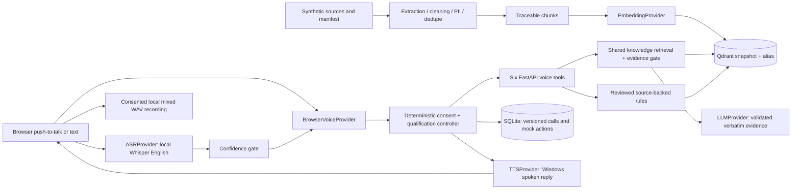

# Phases 0-2 architecture

One FastAPI backend holds the KB and voice tools. React exposes `/call`; `/live` remains a Phase 4 placeholder. No managed telephony service, queue, worker fleet or extra microservice is needed for this bounded browser prototype.

The browser captures one PCM WAV utterance at a time, checks its signal level, normalizes quiet audio to mono 16-kHz PCM, sends it to the local Whisper ASR adapter and plays the backend's synthesized response. The UI exposes microphone selection and an input meter. Whisper recognition runs in an isolated CPU process against a pre-downloaded local model, with one recognition job at a time, bounded threads, timeout/cancellation and process cleanup. No model download or hosted audio request occurs inside the API. Windows TTS runs isolated PowerShell speech processes. Errors/low decoder scores leave qualification unchanged and offer transcription review/repetition/typed input; newly recognized details require confirmation. Windows confidence and Whisper decoder scores have separate thresholds. This utterance workflow implements Q1, not Q4 streaming ASR.

The conversation controller owns consent, pending field/action, tentative/confirmed/conflicting values and terminal state. LLM interpretation is optional and can only classify intent/exact customer evidence; numeric/string validators control accepted values. Policy answers always pass through the shared KB tool. Eligibility reads reviewed rules, verifies published source ID/version/checksum/quote, and returns preliminary status and citations. Rules cannot silently survive an incompatible KB rebuild. Human actions remain mock requests.

SQLite is sufficient for this single-instance prototype. Eight tables include the new escalation records. A non-destructive SQLite migration adds call revision to Phase 0 databases; SQLAlchemy optimistic version checks reject concurrent overwrites. Turn IDs and stable business-action IDs make retries idempotent. A changed callback time is a conflict requiring manual handling. Production needs migration tooling and transactional coordination appropriate to its database.

Qdrant stores complete KnowledgeRecord payloads with vector top-k product/language filtering. Provider signatures isolate vector spaces. Full rebuilds validate staging collections before switching aliases. The default hashing vectors have documented semantic limitations; optional hosted embeddings require a fresh rebuild and evidence-threshold calibration. The answer adapter returns only validated passages from retrieved evidence.

All provider calls use timeouts and safe fallbacks. Logs contain approved event/exception classes, counts, request IDs and tool names; no transcript/query/provider body or credentials. Basic redaction precedes transcript persistence and optional hosted interpretation. No customer text is interpolated into shell command arguments: speech input is passed in private temporary files.

Recordings start after separate recording and qualification consent, live under ignored private storage, and are saved on completion/end. Public evaluation audio is labelled synthesized synthetic dialogue. The prototype is loopback-only with no authentication; real customer use requires access control, encryption, retention policy and legal review. Q3 language state and Q4 streaming/events/suppression/metrics remain future work.
