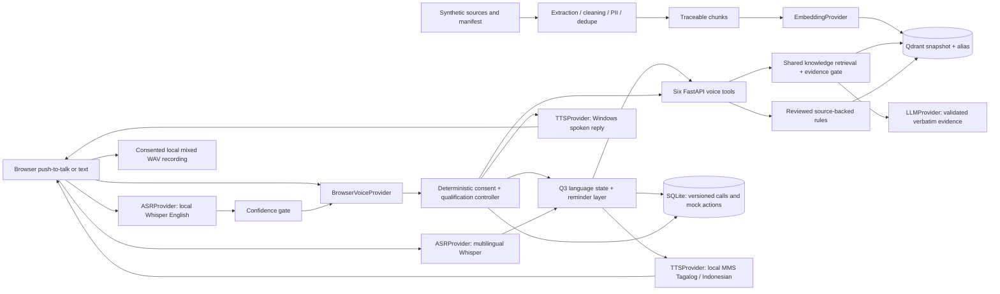
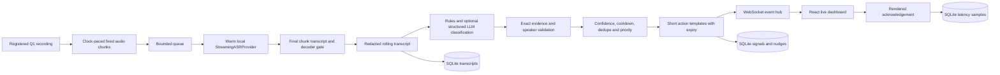

# Phases 0-7 architecture

One FastAPI backend holds the KB, voice tools and replay analysis. React exposes `/call` and `/live`. Browser voice orchestration was selected for reproducible local microphone access, spoken replies and observable tools without telephony account setup. It implements the browser option in BUILD_STEPS; a managed telephony/streaming platform is a possible production adapter when PSTN access and operational capacity are required.

The browser captures one PCM WAV utterance at a time, checks its signal level, normalizes quiet audio to mono 16-kHz PCM, sends it to the local Whisper ASR adapter and plays the backend's synthesized response. The UI exposes microphone selection and an input meter. Whisper recognition runs in an isolated CPU process against a pre-downloaded local model, with one recognition job at a time, bounded threads, timeout/cancellation and process cleanup. No model download or hosted audio request occurs inside the API. Windows TTS runs isolated PowerShell speech processes. Errors/low decoder scores leave qualification unchanged and offer transcription review/repetition/typed input; newly recognized details require confirmation. Windows confidence and Whisper decoder scores have separate thresholds. This utterance workflow implements Q1, not Q4 streaming ASR.

The conversation controller owns consent, pending field/action, tentative/confirmed/conflicting values and terminal state. LLM interpretation is optional and can only classify intent/exact customer evidence; numeric/string validators control accepted values. Policy answers always pass through the shared KB tool. Eligibility reads reviewed rules, verifies published source ID/version/checksum/quote, and returns preliminary status and citations. Rules cannot silently survive an incompatible KB rebuild. Human actions remain mock requests.

SQLite is sufficient for this single-instance prototype. Eight tables include the new escalation records. A non-destructive SQLite migration adds call revision to Phase 0 databases; SQLAlchemy optimistic version checks reject concurrent overwrites. Turn IDs and stable business-action IDs make retries idempotent. A changed callback time is a conflict requiring manual handling. Production needs migration tooling and transactional coordination appropriate to its database.

Qdrant stores complete KnowledgeRecord payloads with vector top-k product/language filtering. Provider signatures isolate vector spaces. Full rebuilds validate staging collections before switching aliases. Remote collections receive keyword indexes on the two filter fields before publishing; startup migrates older active collections. This meets [Qdrant strict-mode filtering requirements](https://qdrant.tech/documentation/search/text-search/text-filtering/). Embedded Qdrant evaluates filters directly and does not implement those indexes. Qdrant is sufficient for this small metadata-rich corpus; extra search infrastructure is unnecessary. Default hashing vectors have documented semantic limitations; hosted embeddings require a rebuild and threshold calibration. The answer adapter returns only validated passages from retrieved evidence.

All provider calls use timeouts and safe fallbacks. Logs contain approved event/exception classes, counts, request IDs and tool names; no transcript/query/provider body or credentials. Basic redaction precedes transcript persistence and optional hosted interpretation. No customer text is interpolated into shell command arguments: speech input is passed in private temporary files.

Q3 adds market/register state to the existing call JSON without a new database or backend. A reminder module dispatches through the same browser voice provider and shared transcript persistence, KB retrieval, callback and escalation tools. Product/language filters isolate life-insurance and consumer-finance facts; no policy facts live in system prompts. Deterministic topic mapping handles supported definition/reminder questions and withholds unsupported benefits, discounts and fee waivers. Draft greetings, politeness, confirmation and safe fallback copy is kept in market modules. Language choice uses explicit selection plus a small vocabulary; short acknowledgements retain the current register.

Q1 keeps its English Whisper model. Q3 selects a separate multilingual Whisper model, with `tl`, `id`, `en` or automatic Taglish detection; the same bounded worker adapter handles both. Local MMS single-language models synthesize Filipino/Taglish and Indonesian in cancellable processes. Customer text enters private temporary files and inference never contacts hosted services. Native-speaker validation and mixed-English pronunciation remain documented limitations. The published Batak news sample is downloaded privately and used as one regional ASR observation, not an accuracy guarantee.

Recordings start after separate recording and conversation consent, live under ignored private storage, and are saved on completion/end. Public evaluation audio is labelled synthesized synthetic dialogue. The prototype is loopback-only with no authentication; real customer use requires access control, encryption, retention policy and legal review.

## Q4 streaming path

Only the WAV header and role/timing metadata are read before replay. The producer reads one six-second PCM chunk and releases it after that duration has elapsed. The consumer keeps one cancellable Whisper CPU worker warm, transcribes continuously and evaluates a 45-second rolling window. Local ASR emits final chunk text; token-level partial output and production diarization are not implemented. Offline annotations label only registered synthetic single-role chunks; no reference words enter ASR or the detector.

The queue, context, retained jobs and per-call subscribers have explicit bounds. One active replay is allowed; overload or a dead ASR stream safely stops analysis. Event subscribers get a persisted snapshot on reconnect; slow subscribers are disconnected. This is single-process fan-out, not distributed resumable delivery.

The default rule detector is conservative and tested for roles/negation. An opt-in semantic classifier uses the existing LLMProvider and the [official Structured Outputs interface](https://developers.openai.com/api/docs/guides/structured-outputs). Its newest-segment evidence must match literally and its speaker must match the annotation; provider errors/timeouts preserve rule detection. Scores are heuristics. Nudge text uses short safe action templates, configured suppression and expiry; it never executes a payment or other business action.

Monotonic stamps cover audio availability, ASR completion, signal completion, nudge completion and the first observer acknowledgement. SQLite stores acknowledged samples only. Delivery includes observer processing and the return trip; rendered Chrome acknowledgements differ from CLI receipt acknowledgements. Warmup and up to six seconds of chunk capture are reported separately. Deterministic nudge generation occupies the schema's llm_latency_ms stage; optional LLM signal classification occupies signal time. Generated percentiles and sample counts are in the [Q4 report](q4-latency-report.md).

Production changes for replicated sessions, transactional state, managed vector scaling, provider quotas, backpressure, WebSocket fan-out, retention and noisy/native speech are documented in [production improvements](production-improvements.md). They are not implemented just to claim scale.
